# Hangman
A simple hangman game in Java

At the opening screen, we have the option od selescting the level of difficulty.

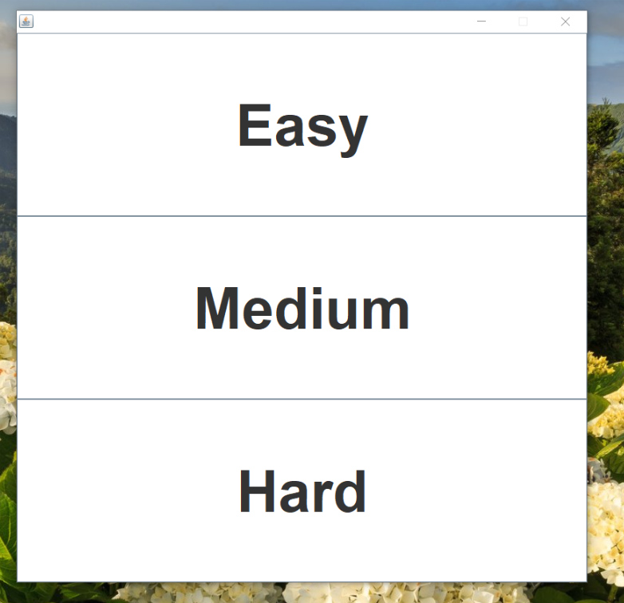

Let's select Easy.

This is the initial game view:

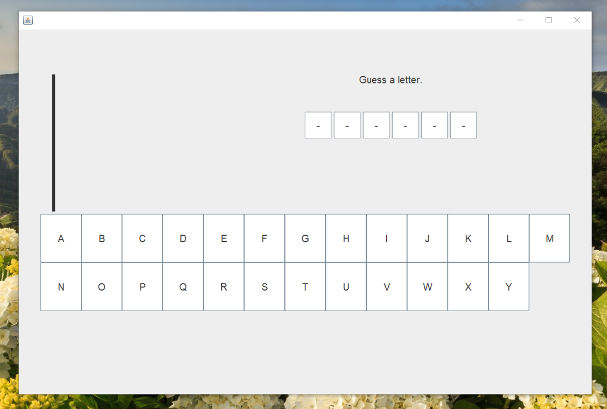

Let's make a guess. I chose the letter E.

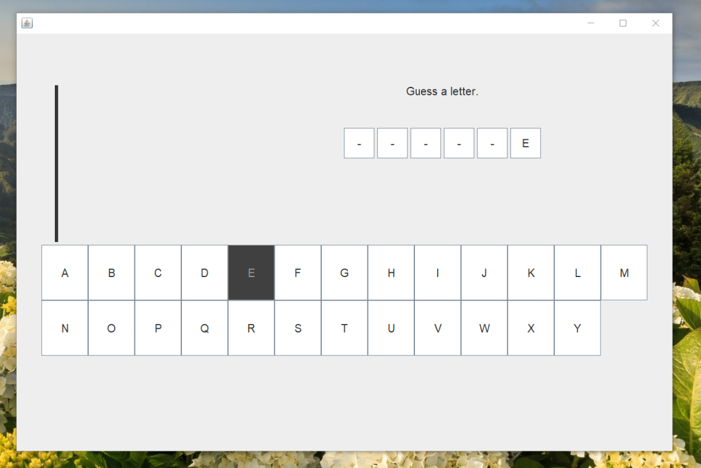

I guessed right!

Now I'll chose the letter S

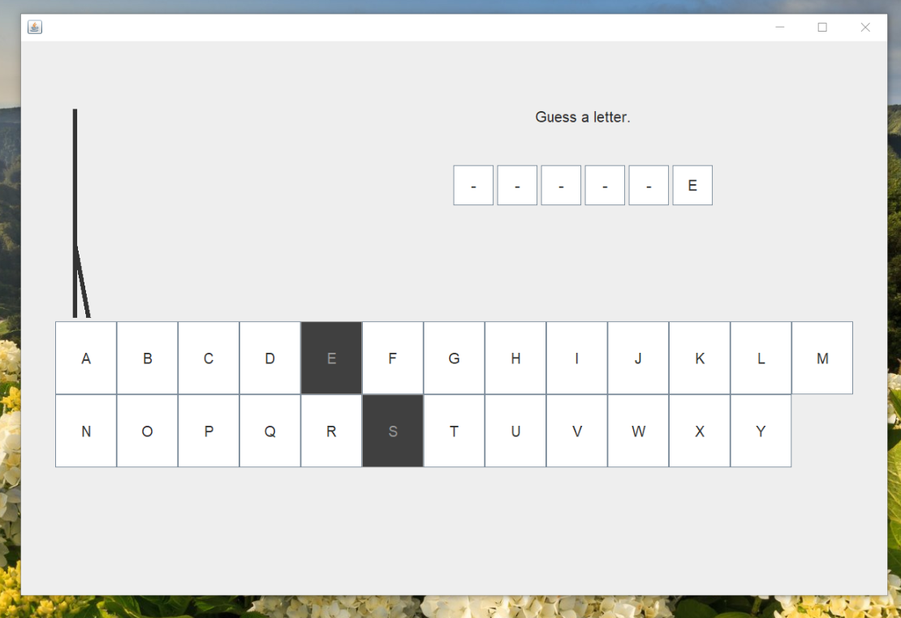

Oh no! That was not the right letter. I was penalized as a line was drawn on the hangman

Let me chose some more letters.

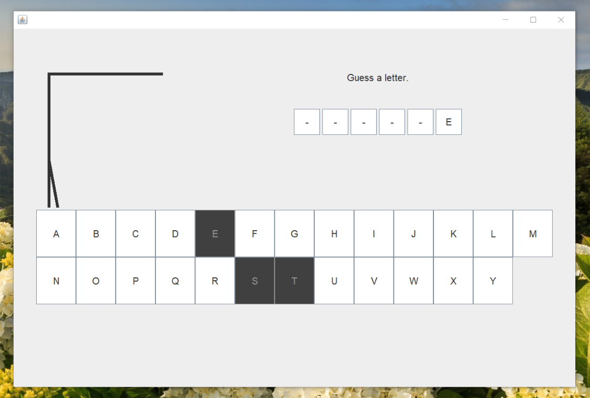

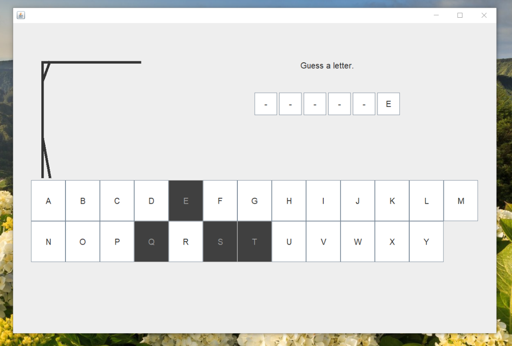

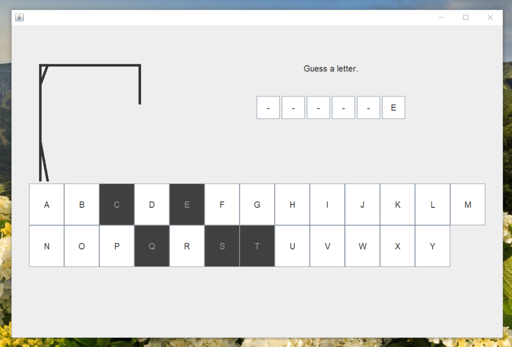

All those choices were wrong asnd my hangman picture is getting more detail

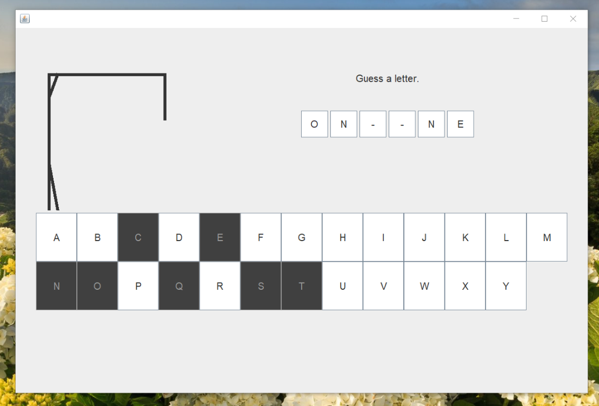

I chose the letters O and N. They were right! I'm close to winning now

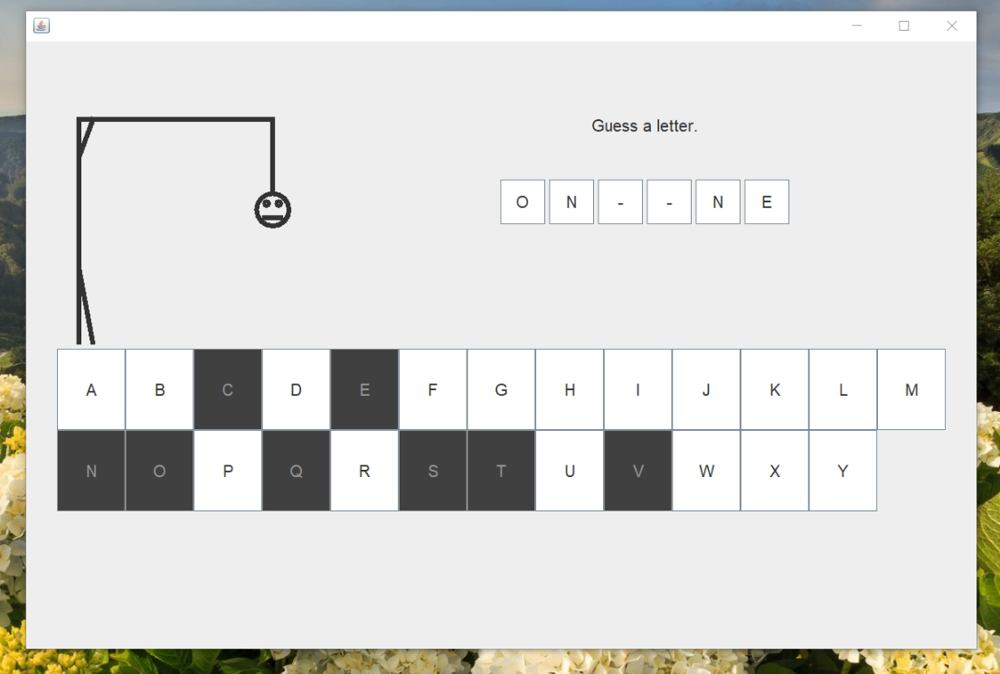

I chose the wrong letter. Now I can see the Hangman's head

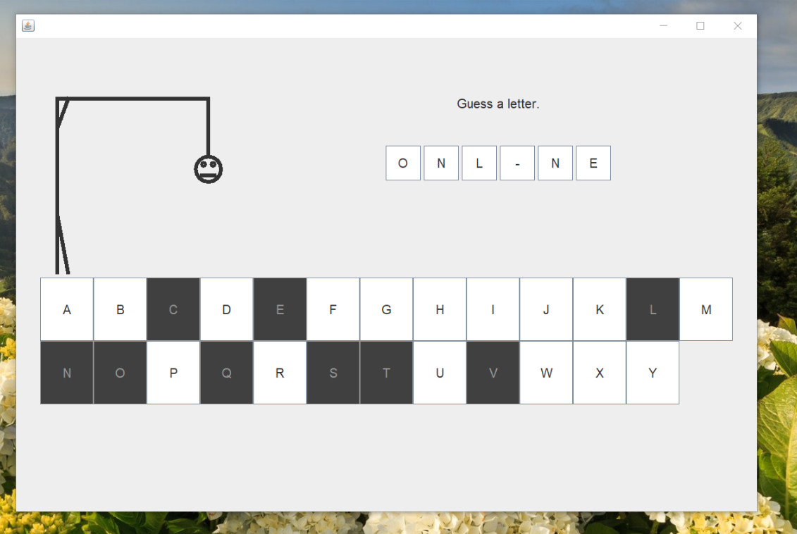

The letter L is correct!

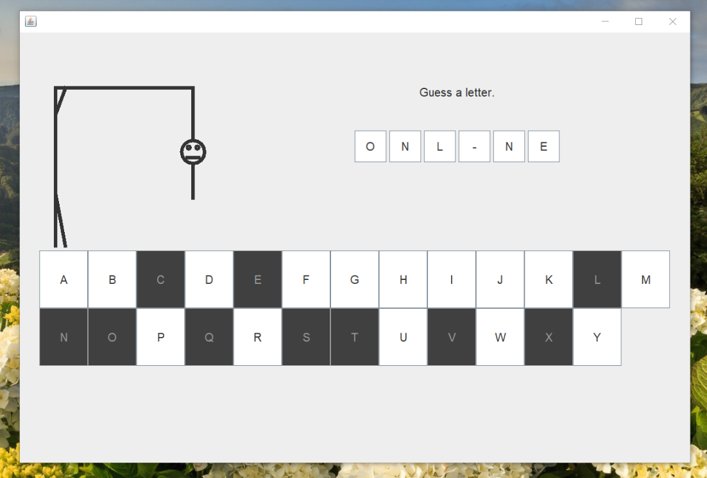

I chose another wrong letter.

I think the last letter is I, to make the completed word ONLLINE

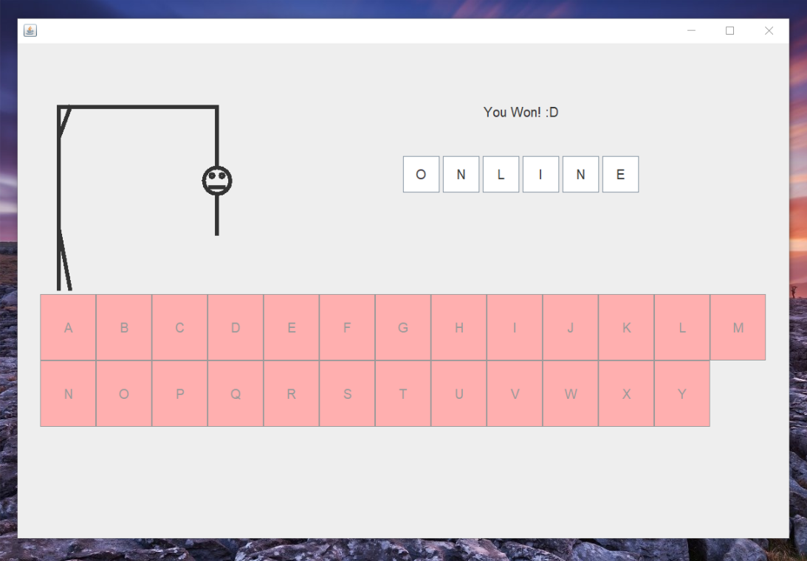

I won the game! The alphabet letters on the bottom are now unclickable

